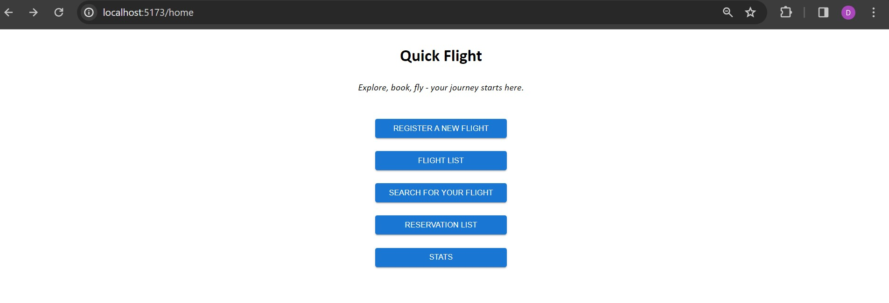
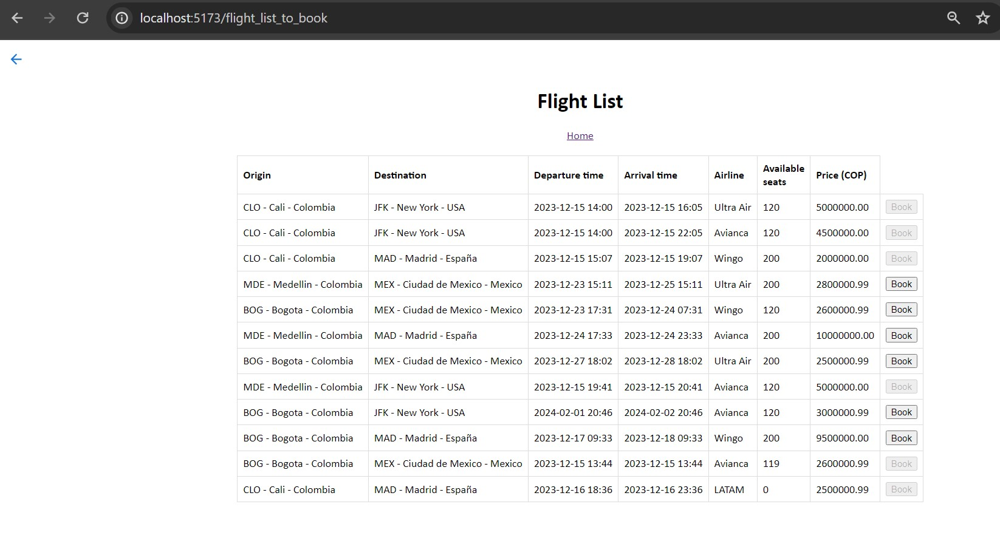

# Proyecto Frontend de la app QuickFlight

   

---

Esta aplicación cliente es la interfaz gráfica del proyecto QuickFlight el cual va a permitir crear vuelos de avión así como la solicitud de reservas de vuelos basados en datos como el origen, destino, fechas de partida y llegada, y por último la visualización de estadísticas.

- Se desplegó en el servicio *"Amplify"* de AWS obteniendo la siguiente URL pública:

https://production.dftkopmtc08o1.amplifyapp.com/home

---






---

### Versiones usadas en desarrollo

- Sistema operativo local: Windows 10
- Entorno de desarrollo: Visual Studio Code
- Versión de Node: 18.13.0
- Versión react: 18.2.0
- Versión vite: 5.0.8
- Version Docker: 4.26.1

---


### Guía de descarga a local

- Se debe tener instalado Python y Git

1. Abre la terminal o línea de comandos en el computador donde deseas descargar el proyecto. Se recomienda colocar al mismo nivel de la carpeta del backend para poder ajustar facilmente el **"docker-compose.yml"**

2. Navega al directorio donde deseas almacenar el repositorio.

3. Ejecuta el siguiente comando de Git para clonar el repositorio a la carpeta actual, esto copiará todas las ramas:
```sh
git clone https://github.com/dago-tech/Project_4_QuickFlight_Frontend.git
```

4. Muévete a la rama main:

```sh
git checkout main
```
5. Instala las dependencias del package.json

```sh
npm i
```

5. Correr el servidor de desarrollo:
```sh
npm run dev
```

9. Ya se puede visitar la aplicación haciendo uso del **localhost:5173**. En este caso si estás corriendo el backend en local se debe ajustar la URL de la API en el archivo *.helpers/axios.js* a:

```sh
http://localhost:8000/api/
```

### Docker

De esta aplicación también se puede generar un contenedor utilizando el archivo dockerfile incluido en la raiz del proyecto usando los siguientes comandos:

- Arrancamos Docker desktop

- Nos ubicamos en la raíz del proyecto donde se encuentra el dockerfile y construimos la imagen del contenedor con el nombre que desee:

```sh
docker build -t nombre_de_la_imagen .
```
- Corremos el contenedor y exponemos el puerto 5173 del host y del contenedor, lo creamos con el nombre que le quedamos dar:
```sh
docker run -p 5173:5173 --name nombre_del_contenedor nombre_de_la_imagen
```
- Ahora, con el contenedor corriendo, podemos inglesar a la aplicación por medio del navegador y el localhost:5173
